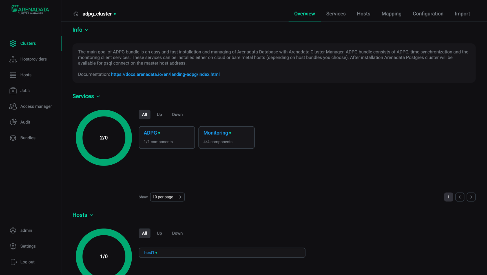
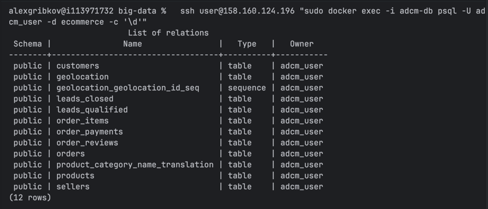
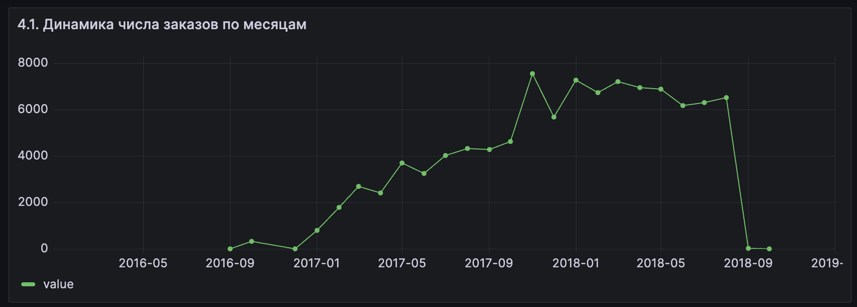
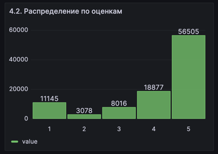
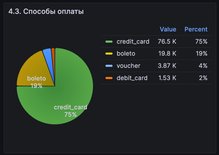
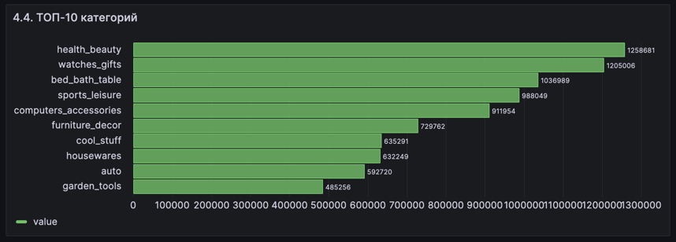
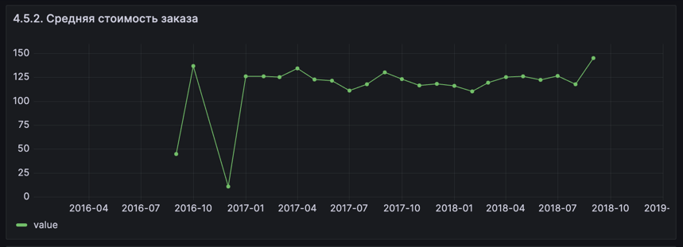
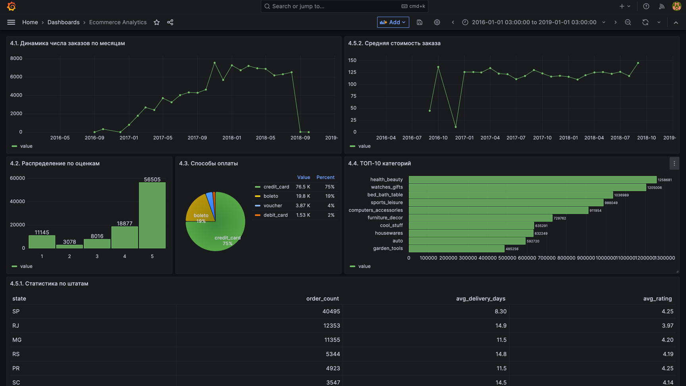

# Практическая работа №8
## Работа с PostgreSQL, ADCM и Grafana

---

## Задание 1. Настройка виртуальной машины



---

## Задание 2. Создание базы данных ecommerce



---

## Задание 3. SQL Запросы

### 3.1. ТОП-10 категорий по выручке, с переводом
**SQL КОД РЕШЕНИЯ:**

```sql
SELECT
    p.product_category_name AS category_name,
    pcnt.product_category_name_english AS category_name_english,
    SUM(oi.price) AS total_revenue,
    COUNT(DISTINCT oi.order_id) AS unique_orders,
    COUNT(*) AS total_items
FROM order_items oi
JOIN products p ON oi.product_id = p.product_id
LEFT JOIN product_category_name_translation pcnt
    ON p.product_category_name = pcnt.product_category_name
WHERE p.product_category_name IS NOT NULL
GROUP BY p.product_category_name, pcnt.product_category_name_english
ORDER BY total_revenue DESC
LIMIT 10;
```

**Результат:**

| category_name | category_name_english | total_revenue | unique_orders | total_items |
|---|---|---|---|---|
| beleza_saude | health_beauty | 1258681.34 | 8836 | 9670 |
| relogios_presentes | watches_gifts | 1205005.68 | 5624 | 5991 |
| cama_mesa_banho | bed_bath_table | 1036988.68 | 9417 | 11115 |
| esporte_lazer | sports_leisure | 988048.97 | 7720 | 8641 |
| informatica_acessorios | computers_accessories | 911954.32 | 6689 | 7827 |
| moveis_decoracao | furniture_decor | 729762.49 | 6449 | 8334 |
| cool_stuff | cool_stuff | 635290.85 | 3632 | 3796 |
| utilidades_domesticas | housewares | 632248.66 | 5884 | 6964 |
| automotivo | auto | 592720.11 | 3897 | 4235 |
| ferramentas_jardim | garden_tools | 485256.46 | 3518 | 4347 |

---

### 3.2. Платежное поведение
**SQL КОД РЕШЕНИЯ:**

```sql
SELECT
    payment_type,
    COUNT(*) AS payment_count,
    ROUND(AVG(payment_installments), 2) AS avg_installments,
    ROUND(AVG(payment_value), 2) AS avg_payment_value,
    ROUND(
        COUNT(DISTINCT order_id)::decimal /
        (SELECT COUNT(DISTINCT order_id) FROM order_payments) * 100,
        2
    ) AS order_share_percent
FROM order_payments
GROUP BY payment_type
ORDER BY payment_count DESC;
```

**Результат:**

| payment_type | payment_count | avg_installments | avg_payment_value | order_share_percent |
|---|---|---|---|---|
| credit_card | 76795 | 3.51 | 163.32 | 76.94 |
| boleto | 19784 | 1.00 | 145.03 | 19.90 |
| voucher | 5775 | 1.00 | 65.70 | 3.89 |
| debit_card | 1529 | 1.00 | 142.57 | 1.54 |
| not_defined | 3 | 1.00 | 0.00 | 0.00 |

---

### 3.3. Зависимость оценки от скорости доставки
**SQL КОД РЕШЕНИЯ:**

```sql
WITH delivery_data AS (
    SELECT
        o.order_id,
        r.review_score,
        EXTRACT(DAY FROM (o.order_delivered_customer_date - o.order_purchase_timestamp)) AS delivery_days
    FROM orders o
    JOIN order_reviews r ON o.order_id = r.order_id
    WHERE o.order_delivered_customer_date IS NOT NULL
        AND o.order_purchase_timestamp IS NOT NULL
)
SELECT
    CASE
        WHEN delivery_days <= 5 THEN 'До 5 дней включительно'
        WHEN delivery_days BETWEEN 6 AND 10 THEN 'От 6 до 10 дней включительно'
        ELSE 'Более 10 дней'
    END AS delivery_interval,
    COUNT(order_id) AS order_count,
    ROUND(AVG(review_score), 2) AS avg_review_score
FROM delivery_data
GROUP BY
    CASE
        WHEN delivery_days <= 5 THEN 'До 5 дней включительно'
        WHEN delivery_days BETWEEN 6 AND 10 THEN 'От 6 до 10 дней включительно'
        ELSE 'Более 10 дней'
    END
ORDER BY
    MIN(CASE
        WHEN delivery_days <= 5 THEN 1
        WHEN delivery_days BETWEEN 6 AND 10 THEN 2
        ELSE 3
    END);
```

**Результат:**

| delivery_interval | order_count | avg_review_score |
|---|---|---|
| До 5 дней включительно | 19008 | 4.43 |
| От 6 до 10 дней включительно | 32408 | 4.35 |
| Более 10 дней | 43451 | 3.90 |

---

### 3.4. Эффективность продавцов
**SQL КОД РЕШЕНИЯ:**

```sql
SELECT
    oi.seller_id,
    COUNT(DISTINCT oi.order_id) AS unique_orders,
    COUNT(DISTINCT o.customer_id) AS unique_customers,
    COUNT(*) AS total_items,
    ROUND(SUM(oi.price), 2) AS total_revenue,
    ROUND(AVG(oi.freight_value), 2) AS avg_freight_per_item
FROM order_items oi
JOIN orders o ON oi.order_id = o.order_id
WHERE oi.seller_id IS NOT NULL
GROUP BY oi.seller_id
ORDER BY unique_orders DESC
LIMIT 10;
```

**Результат:**

| seller_id | unique_orders | unique_customers | total_items | total_revenue | avg_freight_per_item |
|---|---|---|---|---|---|
| 6560211a19b47992c3666cc44a7e94c0 | 1854 | 1854 | 2033 | 123304.83 | 13.75 |
| 4a3ca9315b744ce9f8e9374361493884 | 1806 | 1806 | 1987 | 200472.92 | 17.65 |
| cc419e0650a3c5ba77189a1882b7556a | 1706 | 1706 | 1775 | 104288.42 | 14.46 |
| 1f50f920176fa81dab994f9023523100 | 1404 | 1404 | 1931 | 106939.21 | 18.21 |
| da8622b14eb17ae2831f4ac5b9dab84a | 1314 | 1314 | 1551 | 160236.57 | 16.09 |
| 955fee9216a65b617aa5c0531780ce60 | 1287 | 1287 | 1499 | 135171.70 | 16.97 |
| 7a67c85e85bb2ce8582c35f2203ad736 | 1160 | 1160 | 1171 | 141745.53 | 17.85 |
| ea8482cd71df3c1969d7b9473ff13abc | 1146 | 1146 | 1203 | 37177.52 | 14.58 |
| 4869f7a5dfa277a7dca6462dcf3b52b2 | 1132 | 1132 | 1156 | 229472.63 | 17.45 |
| 3d871de0142ce09b7081e2b9d1733cb1 | 1080 | 1080 | 1147 | 94914.20 | 19.56 |

---

## Задание 4. Построение дашборда в Grafana

### 4.1. Динамика числа заказов
**Визуализация:**



**Выводы:**

График демонстрирует устойчивый рост числа заказов с сентября 2016 по август 2018 года. Начальный период (сентябрь 2016 - начало 2017) характеризуется низким объемом (~300-500 заказов в месяц), что типично для стартапа. В течение 2017 года наблюдается экспоненциальный рост с ~500 до ~7000 заказов в месяц, что свидетельствует об успешном масштабировании бизнеса. Пиковый период (ноябрь 2017 - август 2018) показывает стабильно высокий объем заказов (6000-7500 в месяц) с максимумом в ноябре 2017 (~7500 заказов), вероятно связанным с сезонностью. Резкое падение в сентябре 2018 до ~600 заказов может указывать на неполные данные. Общий рост составил 20-кратное увеличение объема заказов.

---

### 4.2. Количество заказов по оценкам
**Визуализация:**



**Выводы:**

Распределение оценок демонстрирует высокий уровень удовлетворенности клиентов с явной асимметрией в сторону положительных оценок. Оценку 5 звезд получили ~57,000 заказов (57%), 4 звезды - ~19,000 (19%), что в сумме составляет 76% положительных отзывов. Оценку 1 звезда получили ~11,500 заказов (12%), что превышает количество оценок 2 и 3 звезды вместе взятых (~11,500 заказов). Такое бимодальное распределение с высоким пиком на минимальной оценке требует внимания - необходимо проанализировать причины крайне негативных отзывов. В целом высокий процент максимальных оценок (57%) свидетельствует о качественном сервисе, но существует значительный сегмент недовольных покупателей.

---

### 4.3. Распределение способов оплаты
**Визуализация:**



**Выводы:**

Анализ способов оплаты показывает доминирование кредитных карт: 76,505 заказов (~77%) оплачены кредитными картами, 19,784 (~20%) - через boleto (банковский ваучер, популярный в Бразилии способ оплаты для клиентов без банковских карт), 3,866 (~4%) - купонами, и лишь 1,528 (~2%) - дебетовыми картами. Кредитные карты доминируют с большим отрывом, что типично для e-commerce. Значительная доля boleto (20%) характерна для бразильского рынка. Низкая доля дебетовых карт может быть связана с отсутствием программ рассрочки для этого способа оплаты. Система поддерживает разнообразные способы оплаты, что расширяет охват аудитории.

---

### 4.4. Топ товарных категорий по объему продаж
**Визуализация:**



**Выводы:**

Топ-10 категорий по выручке возглавляют Health & Beauty (~$1,260K), Watches & Gifts (~$1,205K) и Bed, Bath & Table (~$1,037K). Первые две категории практически равны по выручке и генерируют ~35% от суммарной выручки топ-10. Средняя группа (Sports & Leisure ~$988K, Computers & Accessories ~$912K, Furniture & Decor ~$730K) показывает равномерное распределение выручки. Разрыв между 1-м и 10-м местом (Garden Tools ~$485K) составляет 2.6 раза. Платформа успешна в продаже товаров личного использования (красота, часы, дом). Диверсифицированный портфель категорий снижает риски зависимости от одной ниши и демонстрирует потенциал роста в категориях с высоким чеком (электроника, мебель).

---

### 4.5. Дополнительные визуализации
#### 4.5.1. Статистика по штатам
**Визуализация:**


**Выводы:**

Анализ топ-15 штатов выявляет сильную концентрацию бизнеса на юго-востоке Бразилии: SP (São Paulo) лидирует с 40,975 заказами, RJ (Rio de Janeiro) - 12,433, MG (Minas Gerais) - 11,302, что составляет ~65% всех заказов. Время доставки варьируется от 11.5 дней (SP) до 38.2 дней (RR - Roraima), при этом наблюдается четкая обратная зависимость между временем доставки и рейтингом: штаты с доставкой >30 дней имеют рейтинг <3.5 (AP - 3.40, RR - 3.31), тогда как штаты с доставкой <15 дней имеют рейтинг >3.9. Крупные городские центры (SP, RJ, DF) демонстрируют лучшие показатели доставки (11-14 дней), удаленные северные регионы (RR, AP, AM) - худшие (27-38 дней). Улучшение логистики в удаленных регионах может значительно повысить их рейтинги и расширить клиентскую базу.

---

#### 4.5.2. Средняя стоимость заказа
**Визуализация:**



**Выводы:**

График средней стоимости заказа (AOV) демонстрирует нисходящий тренд с $130 (начало 2017) до $100 (середина 2018). Период становления (сентябрь 2016 - начало 2017) характеризуется высокой волатильностью ($80-150) из-за малого количества заказов. В 2017 году AOV стабилизировался в диапазоне $115-125, после чего началось постепенное снижение. Обратная корреляция с объемом заказов (задание 4.1) показывает, что рост заказов с 500 до 7000 в месяц (+1400%) достигнут за счет снижения среднего чека на 20-25%. Это указывает на выбранную стратегию массового рынка с расширением аудитории в более массовые сегменты. Несмотря на падение AOV, общий рост выручки составил ~1020%, что является отличным результатом. Потенциал роста существует через программы повышения среднего чека (bundle deals, free shipping threshold), upselling и премиум-категории.

---

## Полный дашборд



Интерактивный дашборд Grafana "Ecommerce Analytics" содержит 6 панелей с визуализациями, позволяющих получить комплексное представление о состоянии e-commerce бизнеса и выявить ключевые тренды.
